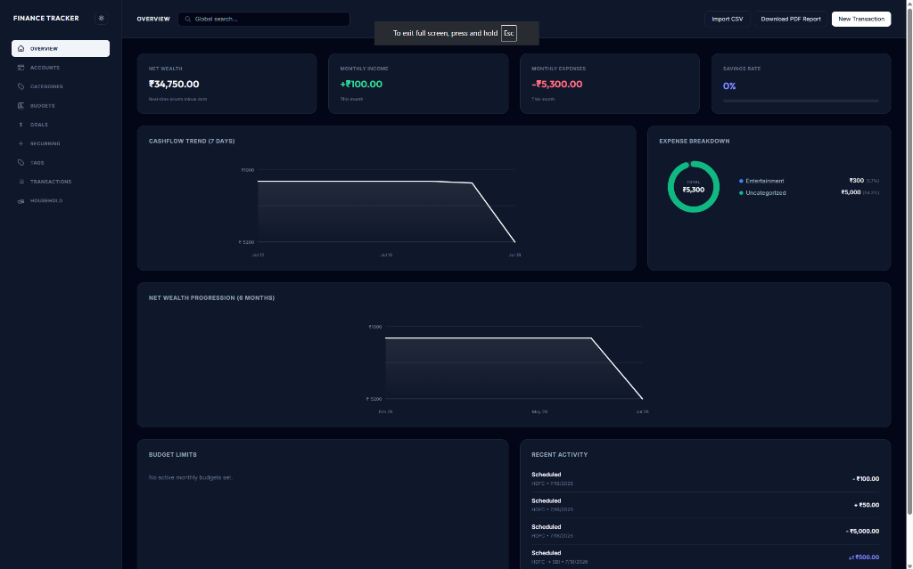
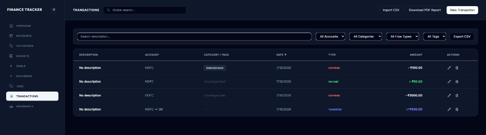
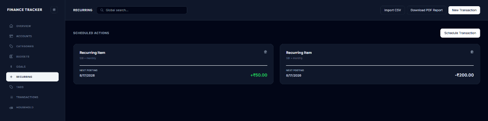

# 🌌 Finance Tracker — Modern Personal & Joint Finance Tracker



Finance Tracker is a beautiful, professional, and full-featured personal finance and budgeting monorepo. It supports multi-account ledgers, interactive visualizations, automated recurring transaction processing, savings goals allocation, and shared household tracking in real-time.

---

## 📷 Screenshots

### Transactions Ledger


### Recurring Transactions Scheduler


---

## 🌟 Key Features

### 💼 Core Accounts & Transfers
* **Multi-Account Support**: Manage Checking, Savings, Credit Card, UPI, and Cash balances in one unified place.
* **Account-to-Account Transfers**: Record transferring money between your own accounts (e.g. Checking to Savings) with automated debit/credit balancing without skewing cashflow reports.

### 👥 Joint Household Sharing
* **Shared Ledgers**: Create a Household or join an existing household via invite codes.
* **Real-time Scoped Data**: Members of the same household instantly share accounts, transactions, categories, budgets, and savings goals.

### 📅 Recurring Transactions & Subscriptions
* **Subscription Management**: Set up repeating income or expense templates (daily, weekly, monthly, or yearly) for Netflix, Rent, Salary, or utility bills.
* **Auto-Processor**: The backend automatically checks for and posts due recurring transactions when loading the ledger, keeping your balance updated dynamically.

### 🎯 Savings Goals & Fund Allocator
* **Goal Milestones**: Define long-term or short-term goals (e.g. Emergency Fund, Travel) with target amounts and dates.
* **Allocator**: Transfer savings from any of your accounts directly into a goal, which posts an expense to the account and logs the contribution towards the goal's progress bar.

### 📊 Visual Analytics & Printable Reports
* **Net Worth Progression**: View your 6-month historical net worth line chart.
* **Interactive Tooltips**: Hover over line charts, cashflow trend lines, or budget donut segments to view detailed popup numbers.
* **Monthly PDF Export**: Download an formatted monthly report optimized for printing or saving directly to PDF using `window.print()` stylesheets.

---

## 🛠️ Technology Stack

* **Frontend**: React.js, Tailwind CSS, Lucide React Icons
* **Backend**: Node.js, Express, JWT (JSON Web Tokens) with Axios transparent auto-rotation refresh tokens
* **Database**: PostgreSQL (relational schemas, auto-migrating tables on startup)

---

## 📂 Project Structure

```
├── Backend/                 # Legacy backend folder (reference)
├── finance-frontend/        # React.js SPA frontend
├── src/                     # Backend Controllers, Routes, and Database Migrations
├── server.js                # Core Express Server
├── schema.sql               # Base database schema
├── package.json             # Root npm configuration (for Backend server)
└── .gitignore               # System, package, and credential exclusions
```

---

## 🚀 Getting Started

### 1. Database Configuration
Make sure you have PostgreSQL running. Set up your credentials in the `.env` file at the root:
```env
PORT=5000
DB_USER=postgres
DB_PASSWORD=admin123
DB_HOST=localhost
DB_PORT=5433
DB_NAME=finance_db
JWT_SECRET=your_jwt_secret_key_here
JWT_REFRESH_SECRET=your_jwt_refresh_secret_key_here
```

### 2. Running the Backend
From the root directory:
```bash
# Install dependencies
npm install

# Run database migrations and start server
npm run dev
```
The server automatically sets up tables and starts running on **http://localhost:5000**.

### 3. Running the Frontend
Navigate to the `finance-frontend` directory:
```bash
cd finance-frontend

# Install dependencies
npm install

# Start React app on port 3001
npm start
```
The client will open in your browser at **http://localhost:3001**.
